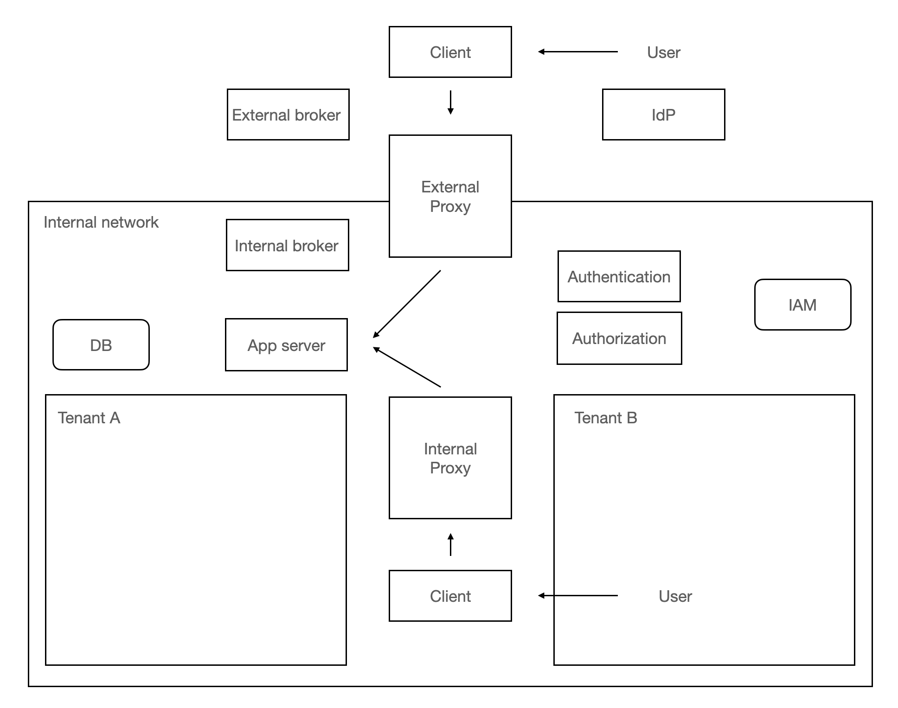

# TSD API: architecture and protocols

The TSD API design outlines a secure multi-tenant HTTP API with event-driven integration points, suitable for deployment in Trusted Research Environments (TREs).

## Component overview

TREs are typically deployed with their own networks which are protected by firewalls, and TSD is no exception in this regard. The figure below shows the overall API design.

Users interact with clients (web services) which in turn connect to application servers (which implement business logic) via proxies. There are two proxies: 1) an external proxy, which has a connection to the network outside of the TRE's perimiter, and the internal network, and 2) an internal proxy, which has access to the management network in the TRE and tenant subnets, where researchers' virtual machines are deployed. The proxies expose services to clients (and users) without exposing them to untrusted networks.

## Authentication

All service data are exposed via HTTP API endpoints implemented by app servers. All API endpoints are protected by access control, which means that all API calls must be authorized - i.e. the API has to determine whether the user is allowed to perform a given action with the given data. Authenticating the user, and the client, is therefore a prerequisite for request authorization.

_insert figure_

To authenticate users, web services that integrate with the TSD API uses the OpenID Connect protocol, either with its own OIDC provider, or with third-party OIDC providers. Third-party OIDC providers integrated on a case-by-case basis. The client redirects the user to the OIDC provider's authentication dialogue, where credentials are given. If successful the OIDC provider issues a code to the client, which it then uses to obtain an ID token. The ID token is a signed assertion about the user, their attributes, and the authentication event.

At this point, the web service must use its own API client credentials to authenticate itself to the API, and also use the ID token, which represents the user, to obtain an API access token. This process is known as a token exchange. The result of the token exchange is a new access token which is another signed assertion about the rights of both the API client and the user.

With the TSD API access token in hand, the web service is now ready to perform a resource request, and the TSD API is able to authorize such a request.

## Authorization

All HTTP traffic is routed through the external and internal proxies. The proxies act as gateways for traffic since each request is first forwarded to the authorization server.

_insert figure_

All resource requests are authorized using information contained in the HTTP headers, according to the same algorithm that check the following:

* verify the signature of the access token against a tenant specific secret
* decode the access token claims
* find all access control grants for matching the current HTTP request: API host name, HTTP method, and URI
* for each access control grant, check if:
  * the access token is authorized
  * the client is authorized
  * the user is authorized - determined by group membership
* optionally check
  * time period limitations on the grant
  * limitations on the amount of times the request can be performed

If all these checks pass, then the request is authorized, and the proxy allows the request to be routed to the app server. The rationale for centralizing authorization is the following:

* having a single policy enforcement point encourages transparency via standardised access control rules
* security and performance critical code is written and optimised once, and bugs are fixed in one place
* it allows the TRE to enforce mandatory access control for its security policies

## Resource requests

Each app server has its own set of access control grants, which are enforced by the central authorization server. So when the app server receives a request these access control grants have been evaluated. If it is not feasible to express all necessary authorization logic in the central authorization server, then the app server can implement additional controls. Other than that they are normal HTTP requests.

## Event-driven integrations

All app servers are integrated with the internal RabbitMQ message broker, and publish messages to API specific exchanges. Each message contains information about which request was performed: the hostname, HTTP method, and URI. Messages do not contain service data, but rather metadata which allows downstream consumers to act on what happened.

_insert figure_

Each exchange has one or more message queues which receive all or a subset of messages which are published to the exchanege, filtering messages according to the application's needs. Message consumers listen to the queues, and perform work based on incoming messages.

Exchanges can be replicated to the external broker on a case-by-case basis, thereby federating the messages to consumer applications running outside of the TRE's internal network.

The integration of the APIs with the message brokers allows for event-driven service development, and contributes to the development of dynamic web applications, while maintaining security and a loosely coupled architecture.

## Flexible service development

The combination of central authorization and event-driven integrations enable flexible and secure service development. Customers can, for example, create their own clients (web services) which communicate with the TRE's APIs, and subscribe to messages on tenant-spececific queues inside and/or outside of the TRE.
